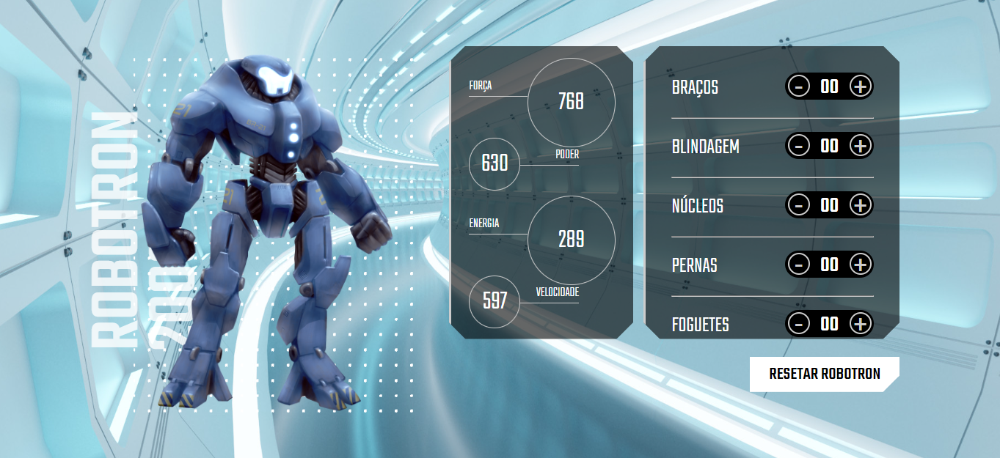
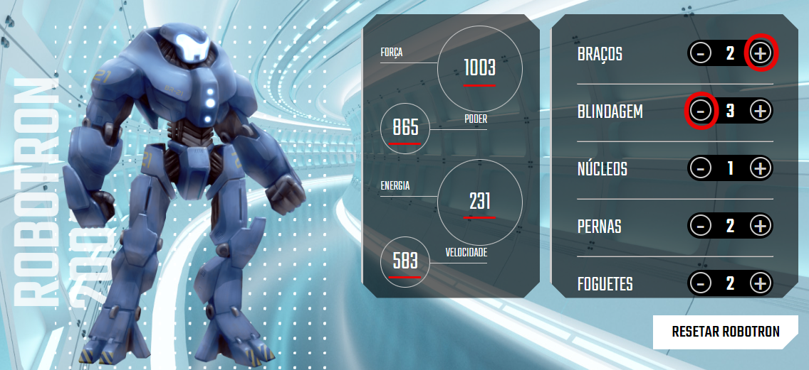
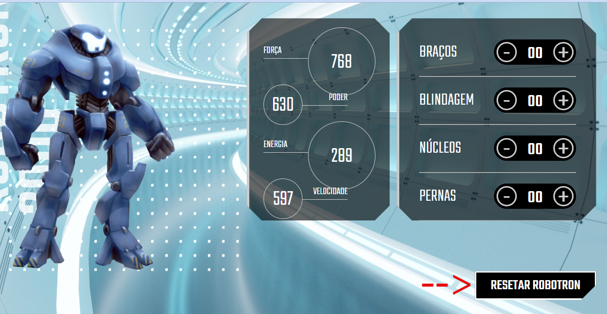

 

<h1>ROBOTRON-2000</h1>

## 📖 Sobre o projeto
Robotron-2000 é um projeto meramente visual desenvolvido nativamente em **JavaScript** , **HTML** e **CSS** para fins didáticos com o intuito de praticar e entender os conceitos de **DOM** (Document Object Model).

## 🖥️ Layout 
  
  
## 🖱️ Como funciona o Robotron-2000
1- Clique no botão de "+" ou de "-" (circulados em vermelho) para aumentar ou diminuir dinamicamente os valores dos atributos (sublinhados em vermelho) 

2- Clique em "Resetar Robotron" para zerar todas as peças e retomar ao valor padrão dos atributos

## 🔨 Ferramentas utilizadas

  
 
